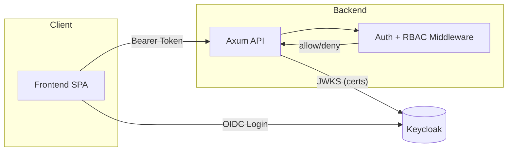
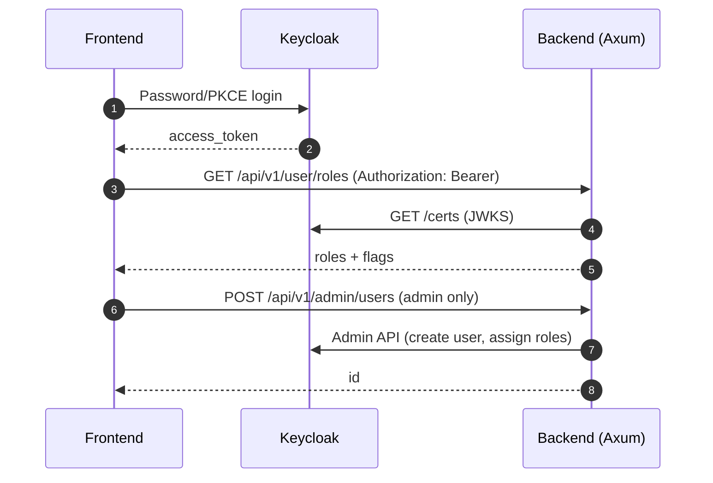

<p align="center">
  
</p>

# KubeAtlas Backend

[](https://www.rust-lang.org/)
[](https://docs.rs/axum)
[](https://www.keycloak.org/)
[](https://docs.docker.com/compose/)
[](LICENSE)
[](https://www.postgresql.org/)
[](https://docs.rs/sqlx)
[](https://tokio.rs/)

Сервис на Rust (Axum) с интеграцией Keycloak: локальная валидация JWT через JWKS, RBAC middleware, админские эндпоинты управления пользователями, «ожидание готовности» Keycloak при старте.

## 🚀 Быстрый старт (Docker Compose)

1. Запуск:
```
docker compose up -d --build
```
2. Проверка здоровья:
```
curl -s http://localhost:3001/health | jq .
```
3. Токен для admin-service:
```
TOKEN=$(curl -s -X POST 'http://localhost:8081/realms/kubeatlas/protocol/openid-connect/token' \
  -d grant_type=password -d client_id=kubeatlas-backend -d client_secret=backend-secret-key \
  -d username=admin-service -d password='AdminPassw0rd!' -d 'scope=openid profile email roles' \
  | python3 -c 'import sys,json; print(json.load(sys.stdin).get("access_token",""))')
```
4. Роли/профиль:
```
curl -s -H "Authorization: Bearer $TOKEN" http://localhost:3001/api/v1/user/roles | jq .
curl -s -H "Authorization: Bearer $TOKEN" http://localhost:3001/api/v1/user/profile | jq .
```
5. Обновление токена (refresh):
```
REFRESH_TOKEN="your_refresh_token_here"
curl -s -X POST http://localhost:3001/auth/refresh \
  -H 'Content-Type: application/json' \
  -d '{"refresh_token":"'$REFRESH_TOKEN'"}' | jq .
```
6. Выход из системы:
```
curl -s -X POST http://localhost:3001/auth/logout \
  -H 'Content-Type: application/json' \
  -d '{"refresh_token":"'$REFRESH_TOKEN'"}' | jq .
```
5. Создание пользователя (admin):
```
TS=$(date +%s)
curl -s -X POST http://localhost:3001/api/v1/admin/users \
  -H "Authorization: Bearer $TOKEN" -H 'Content-Type: application/json' \
  -d '{"username":"user_'"$TS"'","email":"user_'"$TS"'@example.com","first_name":"U","last_name":"T","password":"StrongPassw0rd!","roles":["user"]}' | jq .
```
8. Управление сессиями и пользователями (admin):
```
# Получить активные сессии пользователя
USER_ID="user-uuid-here"
curl -s -H "Authorization: Bearer $TOKEN" http://localhost:3001/api/v1/admin/users/$USER_ID/sessions | jq .

# Отозвать все сессии пользователя
curl -s -X POST -H "Authorization: Bearer $TOKEN" http://localhost:3001/api/v1/admin/users/$USER_ID/sessions/revoke | jq .

# Удалить пользователя (ОСТОРОЖНО: необратимое действие!)
curl -s -X DELETE -H "Authorization: Bearer $TOKEN" http://localhost:3001/api/v1/admin/users/$USER_ID | jq .
```

## ⚙️ Переменные окружения

- SERVER_ADDRESS (default: 0.0.0.0:3001)
- DATABASE_URL
- KEYCLOAK_URL, KEYCLOAK_REALM, KEYCLOAK_CLIENT_ID, KEYCLOAK_CLIENT_SECRET
- ADM_USER, ADM_PASSWORD — автосоздание и обеспечение роли admin
- KEYCLOAK_ADMIN_USER, KEYCLOAK_ADMIN_PASSWORD — для назначения роли admin через Admin API
- JWT_SECRET — опционально; если не задан, генерируется автоматически
- USE_DOTENV=true — для локального чтения .env

## ✨ Особенности
- Локальная проверка JWT через JWKS; фоллбэк на userinfo
- Ожидание готовности Keycloak при старте
- RBAC: `require_admin_middleware` для админских маршрутов
- Полное управление сессиями и refresh token
- Отзыв сессий через admin API

## 🗺️ Архитектура (Mermaid)





## 📚 Документация
- Интеграция фронтенда: `docs/frontend-interation.md`
- Управление пользователями (фронтенд): `docs/user-management-frontend.md`
- Настройка Keycloak: `docs/keycloak.md`
- API эндпоинты: `docs/api.md`

## 🛠️ Сборка вручную
```
cargo build --release
./target/release/kubeatlas-backend
```

## Лицензия
MIT
